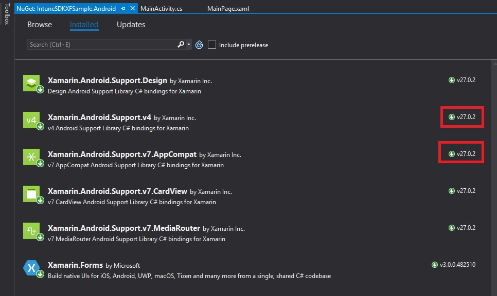

# Xamarin Forms Intune SDK Sample and Step by Step Guide

This sample and guide shows how to :
* integrate Intune app protection policies support into Xamarin Forms app
* publish app with Microsoft Intune 
* enable clipboard and screenshot protection for your mobile app in Intune
* enjoy as a result that no one can copy text from your app or take screenshot :-)

1. Visual Studio -> New Project -> Cross-Platform -> Xamarin Forms 
2. .NET Standard as code sharing strategy 
3. Let's add couple of controls to *MainPage.xaml* to test screenshot and clipboard protection:
```xml
    <StackLayout Orientation="Vertical" HorizontalOptions="Center" VerticalOptions="Center">
        <!-- Place new controls here -->
        <Label Text="Confidential Information!" 
           HorizontalOptions="CenterAndExpand"
           VerticalOptions="Center" />
        <Entry x:Name="txtEntry" Text="Very Sensitive Data" />
    </StackLayout>
```

## Android Implementation

4. Go to Android project - > Manage NuGet packages
5. Ensure you have at minimum these versions of Android support packages referenced:
   * Xamarin.Android.Support.Compat (>= 26.1.0.1)
   * Xamarin.Android.Support.v7.AppCompat (>= 26.1.0.1)



5. Add *Microsoft.Intune.MAM.Xamarin.Android* NuGet package to Android project first.
6. Then add *Microsoft.Intune.MAM.Remapper.Tasks* NuGet package to Android project. This remapper will replace standard classes with MAM (Mobile Application Management) classes which supports Intune policies enforcement and management. These MAM-classes will be injected into hierarchy of commonly used Xamarin.Forms classes like *FormsAppCompatActivity* and *FormsApplicationActivity*. Now before building solution you need to create *MAMApplication* class and override MAM implementation of *OnMAMCreate* function. Also for a lot of cases you will need to use MAM equivalents of number of commonly used functions - [full guide here](https://docs.microsoft.com/en-us/intune/app-sdk-android#mamapplication)
7. Create *MAMApplication* class in your Android Project:
```csharp
using System;
using Android.App;
using Android.Runtime;
using Microsoft.Intune.Mam.Client.App;

namespace IntuneSDKXFSample.Droid
{
    [Application]
    public class IntuneMAMFormsSampleApplication : MAMApplication
    {
        /// <summary>
        /// This is necessary because of a leaky abstraction somewhere up the chain:
        /// http://stackoverflow.com/questions/10593022/monodroid-error-when-calling-constructor-of-custom-view-twodscrollview/10603714#10603714
        /// </summary>
        /// <param name="handle">Java reference</param>
        /// <param name="transfer">Ownership transfer</param>
        public IntuneMAMFormsSampleApplication(IntPtr handle, JniHandleOwnership transfer)
            : base(handle, transfer)
        {
        }

        /// <summary>
        /// New abstract method that we need to override
        /// Documentation at https://microsoft.sharepoint.com/teams/Android_SSP/_layouts/15/WopiFrame2.aspx?sourcedoc=%7b56C60010-40D5-4487-BC70-21471C50D1DD%7d&file=Walled%20Garden%20API%20Guide.docx&action=default says:
        /// If your application does not call AuthenticationSettings.setSecretKey (or does not integrate ADAL at all), you may simply return null. 
        /// </summary>
        /// <returns>The ADAL key</returns>
        public override byte[] GetADALSecretKey()
        {
            return null;
        }
    }
}
```

9. Replace *OnCreate(Bundle bundle)* and other methods in *MainActivity.cs* with the following overrides:
```charp
        protected override void OnMAMCreate(Bundle bundle)
        {
            base.OnMAMCreate(bundle);
            global::Xamarin.Forms.Forms.Init(this, bundle);
            LoadApplication(new IntuneSDKXFSample.App());
        }

        protected override void OnMAMActivityResult(int i, Result j, Intent intent)
        {
            base.OnMAMActivityResult(i, j, intent);
        }

        protected override void OnMAMDestroy()
        {
            base.OnMAMDestroy();
        }

        protected override void OnMAMPause()
        {
            base.OnMAMPause();
        }

        protected override void OnMAMResume()
        {
            base.OnMAMResume();
        }

        protected override void OnMAMNewIntent(Intent intent)
        {
            base.OnMAMNewIntent(intent);
        }

        public override void OnMAMPostCreate(Bundle p0)
        {
            base.OnMAMPostCreate(p0);
        }

        public override void OnMAMPostResume()
        {
            base.OnMAMPostResume();
        }

        public override void OnMAMProvideAssistContent(AssistContent p0)
        {

            base.OnMAMProvideAssistContent(p0);
        }

        public override void OnMAMSaveInstanceState(Bundle p0)
        {
            base.OnMAMSaveInstanceState(p0);
        }

        public override void OnMAMStateNotSaved()
        {
            base.OnMAMStateNotSaved();
        }

        public override bool OnMAMPrepareOptionsMenu(IMenu p0)
        {
            return base.OnMAMPrepareOptionsMenu(p0);
        }

        public override bool OnMAMSearchRequested(SearchEvent p0)
        {
            return base.OnMAMSearchRequested(p0);
        }

        public override Android.Net.Uri OnMAMProvideReferrer()
        {

            return base.OnMAMProvideReferrer();
        }
```
9. Reference two namespaces to fix unresolved methods :
```charp
using Android.Content;
using Android.App.Assist;
```
10. Build the project to ensure everything compiles successfully. 